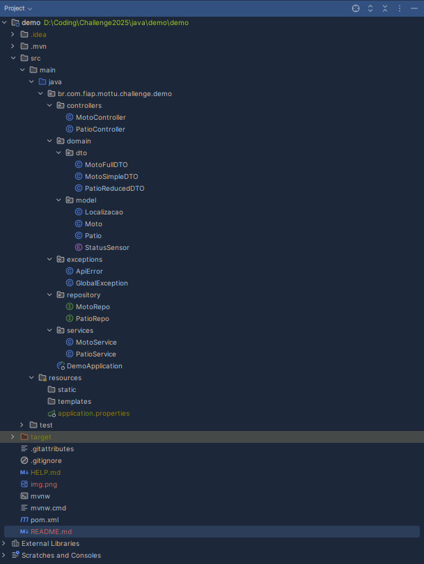

<h1 align="center">Mottu Moto API  </h1>
<p align="center">
  
  </a>
</p>

## Autores

👤 **Samuel Yariwake**
- RM5556461


👤 **Luiz Felipe**
- RM5555591


👤 **Gabriel Lemos**
- RM554819
<hr>

A API Mottu Moto é uma aplicação RESTful desenvolvida em Java com o framework Spring Boot, projetada para gerenciar informações de motos e pátios. Ela oferece funcionalidades como criação, atualização, exclusão e busca de registros, permitindo o gerenciamento eficiente de dados relacionados a pátios e veículos. A API utiliza Spring Data JPA para persistência de dados, Spring Validation para validação de entradas e está integrada a um banco de dados Oracle. Além disso, a documentação interativa da API pode ser acessada via Swagger UI, facilitando a exploração e o uso dos endpoints disponíveis. Este projeto foi desenvolvido como parte de um desafio acadêmico em parceria com a FIAP e a Mottu.
<hr>

## Tecnologias Utilizadas

- **Java 21**
- **Spring Boot 3.4.5**
- **Spring Data JPA**
- **Spring Validation**
- **Spring Web**
- **Oracle Database**
- **Maven**

## Configuração do Ambiente

### Pré-requisitos

- **Java 21** instalado
- **Maven** instalado
- Banco de dados Oracle configurado

### Configuração do Banco de Dados

Certifique-se de que o banco de dados Oracle esteja configurado e acessível. Atualize as credenciais no arquivo `src/main/resources/application.properties`:

```ini
spring.datasource.url=jdbc:oracle:thin:@oracle.fiap.com.br:1521:orcl
spring.datasource.username=SEU_USUARIO
spring.datasource.password=SUA_SENHA
```

### Executando o Projeto

1. Clone o repositório:
   ```bash
   git clone https://github.com/lemos000/challenge-mottu.git
   cd challenge-mottu
   ```

2. Compile e execute o projeto:
   ```bash
   mvn spring-boot:run
   ```

3. Acesse a API em: [http://localhost:8080](http://localhost:8080)
4. Você pode acessar a documentação da API em [http://localhost:8080/swagger-ui/index.html](http://localhost:8080/swagger-ui/index.html)

## Endpoints

### Pátios

- **GET** `/patios`
  Lista os pátios com filtros opcionais por nome e capacidade máxima.

- **GET** `/patios/{id}`
  Retorna os detalhes de um pátio específico.

- **POST** `/patios`
  Cria um novo pátio.

- **PUT** `/patios/{id}`
  Atualiza os dados de um pátio existente.

- **DELETE** `/patios/{id}`
  Remove um pátio.

### Motos

- **GET** `/motos`
  Lista as motos com filtros opcionais por modelo e status do sensor.

- **GET** `/motos/{id}`
  Retorna os detalhes de uma moto específica.

- **POST** `/motos`
  Cria uma nova moto.

- **PUT** `/motos/{id}`
  Atualiza os dados de uma moto existente.

- **DELETE** `/motos/{id}`
  Remove uma moto.

## Estrutura do Projeto

- `src/main/java/br/com/fiap/mottu/challenge/demo/controllers`
  Contém os controladores REST.

- `src/main/java/br/com/fiap/mottu/challenge/demo/domain`
  Contém os modelos, DTOs e classes relacionadas.

- `src/main/java/br/com/fiap/mottu/challenge/demo/services`
  Contém a lógica de negócios.

- `src/main/java/br/com/fiap/mottu/challenge/demo/repository`
  Contém os repositórios JPA.

- `src/main/resources`
  Contém arquivos de configuração, como `application.properties`.

### Exemplo de Objeto para **Pátio**

#### **POST /patios**
**Requisição:**
```json
{
  "nome": "Pátio Central",
  "capacidadeMaxima": 100,
  "areaTotal": 500.0,
  "observacoes": "Pátio principal para motos."
}
```

**Resposta:**
```json
{
  "id": 1,
  "nome": "Pátio Central",
  "capacidadeMaxima": 100,
  "areaTotal": 500.0,
  "observacoes": "Pátio principal para motos.",
  "motos": []
}
```

---

### Exemplo de Objeto para **Moto**

#### **POST /motos**
**Requisição:**
```json
{
  "modelo": "Honda CG 160",
  "placa": "ABC1234",
  "chassi": "9C2KC0810R1234567",
  "ativa": true,
  "statusSensor": "ATIVADO",
  "localizacaoAtual": {
    "andar": "Térreo",
    "vaga": "A1"
  },
  "patio": {
    "id": 1
  }
}
```

**Resposta:**
```json
{
  "id": 1,
  "modelo": "Honda CG 160",
  "placa": "ABC1234",
  "chassi": "9C2KC0810R1234567",
  "ativa": true,
  "statusSensor": "ATIVADO",
  "localizacaoAtual": {
    "andar": "Térreo",
    "vaga": "A1"
  },
  "patio": {
    "id": 1,
    "nome": "Pátio Central"
  }
}
```

---


## Acadêmico

Este é um projeto acadêmico feito em colaboração com a FIAP e Mottu, como parte do curso de Análise e Desenvolvimento de Sistemas.


```